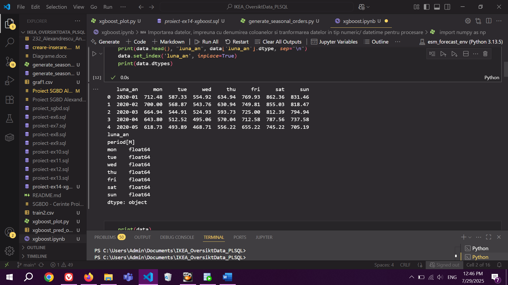

## Setup

Oracle Database 23AI FREE

Cu VM

- Nu funcționează fără VM deoarece dacă Oracle 23AI e folosit pe un Windows host machine pentru a rula orice algoritm de machine learning va necesita pachetul DBMS\_DATA\_MINING, care e considerat ”an unsupported feature” în Windows, în schimb, folosind [Oracle Database 23ai Free VirtualBox Appliance - Developer Version](https://www.oracle.com/database/technologies/databaseappdev-vm.html) ce rulează pe Oracle Linux, pachetul va fi valabil și se vor putea rula script-uri conținând logica de ML doar de către SYS sau un alt utilizator căruia îi sunt atribuite privilegiile necesare.

## Descrierea modelului

Modelul e preluat dintr-un proiect anterior: [Script SQL de creare tabele si inserare date](https://github.com/andialexandrescu/IKEA_OversiktData_PLSQL/blob/main/creare-inserare.sql)

### Atribuire privilegii de DBMS_DATA_MINING

- Fără aceste privilegii nu e posibilă folosirea niciunui algoritm de ML
- User-ul căruia îi sunt atribuite privilegii este andi_homedb1

```sql
create role sgbd_role;
 
grant connect to sgbd_role;
grant resource to sgbd_role;
grant create session to sgbd_role;
grant create table to sgbd_role;
grant create view to sgbd_role;
grant create materialized view to sgbd_role;
grant create synonym to sgbd_role;
grant create procedure to sgbd_role;
grant create sequence to sgbd_role;
grant create trigger to sgbd_role;
grant create type to sgbd_role;
grant query rewrite to sgbd_role;
grant select_catalog_role to sgbd_role;
grant alter session to sgbd_role;
grant select any dictionary to sgbd_role;
grant create public database link to sgbd_role;
grant create public synonym to sgbd_role;
 
grant create mining model to sgbd_role;
grant alter any mining model to sgbd_role;
grant drop any mining model to sgbd_role;
grant select any mining model to sgbd_role;
grant execute on dbms_data_mining to sgbd_role;
  
create user andi_homedb1 identified by oracle
profile default
default tablespace users
quota unlimited on users
account unlock;
 
grant sgbd_role to andi_homedb1;
grant unlimited tablespace to andi_homedb1;
```

#### Testare funcționare DBMS_DATA_MINING

Exemplul următor a fost modificat pe baza [acestui link de download (inclus într-o postare de pe un forum Oracle)](https://objectstorage.us-phoenix-1.oraclecloud.com/p/BqK85Rn1zA5MP0vYiqbAdPgs7Z6OmMxw8SD3WCFVm5kY8uReidZ1KPIKkgJ1hCkG/n/axciphqpnohg/b/forums-legacy/o/uploads/WCPYLV4C6676/xgboost-simple-test-case.txt):

```sql
-- an extremely simple test case to narrow down 
--   "feature not supported" error with xgboost 
 
/* 
 
  ERROR at line 1: 
  ORA-40216: feature not supported 
  ORA-06512: at "SYS.DBMS_DATA_MINING", line 355 
  ORA-06512: at "SYS.DBMS_DATA_MINING", line 605 
  ORA-06512: at "SYS.DBMS_DATA_MINING", line 564 
 
*/ 
 
-- create a training data table 
create table test_data 
( 
  case_id number, 
  col_01 number, 
  col_02 number, 
  col_03 number, 
  col_04 number, 
  col_05 number, 
  col_06 number, 
  col_07 number, 
  col_08 number, 
  col_09 number, 
  col_10 number, 
  target number 
); 
 
-- put some random data in this table 
declare 
  new_row test_data%rowtype; 
begin 
  delete from test_data; 
  commit; 
 
  for i in 1..1000 
  loop 
    -- the case_id is just the row number 
    new_row.case_id := i; 
 
    -- random data for my training data 
    new_row.col_01 := dbms_random.value; 
    new_row.col_02 := dbms_random.value; 
    new_row.col_03 := dbms_random.value; 
    new_row.col_04 := dbms_random.value; 
    new_row.col_05 := dbms_random.value; 
    new_row.col_06 := dbms_random.value; 
    new_row.col_07 := dbms_random.value; 
    new_row.col_08 := dbms_random.value; 
    new_row.col_09 := dbms_random.value; 
    new_row.col_10 := dbms_random.value; 
 
    -- 5 "classes" for a classification target 
    new_row.target := mod(i, 5); 
 
    insert into test_data values new_row; 
  end loop; 
 
  commit; 
end; 
/ 
 
-- create a settings table which is necessary for any Oracle data mining 
algorithm 
create table settings 
( 
  setting_name varchar2(30) not null, 
  setting_value varchar2(4000) not null 
); 
 
-- populate the settings with mostly default values for xgboost 
 
begin 
  delete from settings; 
  commit; 
 
  -- generic settings needed for most data mining models 
  insert into settings (setting_name,setting_value) values 
('ALGO_NAME','ALGO_XGBOOST'); 
  insert into settings (setting_name,setting_value) values ('PREP_AUTO','ON'); 
 
  -- settings specific to xgboost 
  --   note that xgboost, unlike most other models, requires lower-case 
parameter names 
  --   (p.s. that is a glitch as Oracle could have easily set those incoming 
  --     parameters lower-case) 
  -- insert into settings (setting_name,setting_value) values 
('booster','gbtree'); 
 
  -- these are the parameters that I was using originally, but I have removed 
then as you 
  --   don't need them for a test.  Oracle will automatically use default 
values if you 
  --   don't specify a value. 
 
  -- insert into settings (setting_name,setting_value) values ('alpha','0'); 
  -- insert into settings (setting_name,setting_value) values ('eta','.3'); 
  -- insert into settings (setting_name,setting_value) values ('gamma','0'); 
  -- insert into settings (setting_name,setting_value) values ('lambda','1'); 
  -- insert into settings (setting_name,setting_value) values 
('max_delta_step','0'); 
  -- insert into settings (setting_name,setting_value) values 
('max_depth','6'); 
  -- insert into settings (setting_name,setting_value) values 
('max_leaves','0'); 
  -- insert into settings (setting_name,setting_value) values 
('min_child_weight','1'); 
  -- insert into settings (setting_name,setting_value) values 
('num_parallel_tree','1'); 
  -- insert into settings (setting_name,setting_value) values 
('num_round','10'); 
  -- insert into settings (setting_name,setting_value) values 
('objective','multi:softprob'); 
  -- insert into settings (setting_name,setting_value) values 
('scale_pos_weight','1'); 
  -- insert into settings (setting_name,setting_value) values 
('subsample','1'); 
  -- insert into settings (setting_name,setting_value) values 
('tree_method','auto'); 
 
  commit; 
end; 
/ 
 
-- now call the DBMS_DATA_MINING CREATE_MODEL function 
 
begin 
  -- if already there, delete it 
  begin 
    dbms_data_mining.drop_model(model_name => 'MY_MODEL'); 
  exception when others then 
    null; 
  end; 
 
  dbms_data_mining.create_model 
  ( 
    model_name => 'MY_MODEL', 
    mining_function => dbms_data_mining.classification, 
    data_table_name => 'TEST_DATA', 
    case_id_column_name => 'CASE_ID', 
    target_column_name => 'TARGET', 
    settings_table_name => 'SETTINGS', 
    xform_list => null 
  ); 
end; 
/
```

# Seasonal Sales Predictor – Pipeline ML

## Context

Se consideră un pipeline ML care va fi antrenat să prezică numărul de vânzări din fiecare zi, ținând cont de sezonalitate și fiind evaluat pentru ultimul an în care s-au înregistrat vânzări (2024). Pentru implementarea pipeline-ului, se vor considera alte proceduri ajutătoare: inserare a comenzilor și cantităților de produse asociate fiecărei comenzi; generare a unui **seasonal pattern** la nivelul numărului de comenzi, produse și a cantității din fiecare; crearea unui tabel cu media vânzărilor pentru fiecare asociere de lună și an în funcție de ziua din săptămână a vânzării pentru plotarea unei sinusoide (verificarea generării a tiparului sezonier).

## Observații

Implementarea unui algoritm de ML în Oracle SQL implică utilizarea funcțiilor și setărilor din dbms_data_mining, motiv pentru care cele mai consultate surse au fost [DBMS_DATA_MINING — Model Settings Docs Oracle](https://docs.oracle.com/en/database/oracle/oracle-database/21/arpls/DBMS_DATA_MINING.html#GUID-8987EE6F-41A9-4DF9-997C-129B41FDC59A) și [Scoring with XGBoost - Docs Oracle](https://docs.oracle.com/en/database/oracle/machine-learning/oml4sql/21/dmcon/xgboost.html#GUID-4163AA06-FE14-4AB2-98F6-83AE53633DF5).

Pentru a vizualiza exercițiile propuse spre rezolvare, multe implicând o interpretare vizuală a datelor, am decis să implementez logica principală în PL SQL și interogări SQL, urmând ca plotările să le vizualizez pe baza tabelelor și interogărilor generate în format CSV într-un Jupyter Notebook folosind matplotlib, evitând să folosesc agregări și alte prelucrări ale datelor în Python cu pandas. Știu de existența [report-urilor care pot fi generate în SQL Developer](https://medium.com/oracledevs/rocking-user-defined-reporting-with-oracle-sql-developer-b941e67d716f), însă sunt destul de robuste, nefiind o alegere potrivită. Exportarea ca și CSV se face prin click dreapta, export, schimbare format din **insert** în **csv**, browse împreună cu alegerea unui path.

## Generare/ colectare/ preprocesare date

Având în vedere problema unui **time series forecast** al vânzărilor unei firme de retail, unde volumul produselor achiziționate este influențat de diverși factori, este necesară etapa de pregătire a datelor și extragere a caracteristicilor (data preparation and feature extraction) pentru modelare: perioadele preferate de clienți pentru mobilarea locuințelor permanente sau sezoniere, amenajarea sălilor de birouri, precum și de achiziția accesoriilor/ obiectelor decorative de-a lungul anilor pentru a aduce schimbări funcționale/ estetice într-o locuință etc. Acest **time series forecast** tinde înspre un trend și seasonal pattern, însemând o creștere a volumului vânzărilor, urmată de o scădere într-un anumit trimestru din fiecare an.

Întregirea setului de date și stabilirea unui comportament al cererii

După o consultare a datelor inserate în tabelele **COMENZI** și **ADAUGA_COMANDA**, poate fi observată necesitatea unei „întregiri” a setului de date pentru a obține un model fără **skewed data** (îmi ușurează munca și mă pot concentra pe tunarea modelului), adică inserarea mai multor comenzi și cantități de produse asociate lor pornind de la comportamentele diferite ale clienților, cum au fost descrise anterior, însemnând că va trebui să stabilesc niște reguli de funcționare a cererii și vânzării.

În mod normal, comenzile ar fi date de o mulțime de clienți, însă pentru a facilita procesul de inserare, am ales să ignor acest detaliu întrucât nu plănuiesc să calculez la partea de colectare și preprocesare a datelor un număr de clienți care au făcut achiziții între anumite perioade stabilite, de aceea nu voi face inserări în tabela CLIENT, concentrându-mă mai mult pe cantitatea vânzărilor, împreună cu creșteri și scăderi observate în anumite luni ale anului.

Regulile pe baza cărora voi încerca să fac inserările sunt următoarele:

 - pe perioada unui an, vor exista perioade de creștere și scădere pentru cererea mobilierului
 - pe perioada unei săptămâni, vor exista zile în care sunt vândute mai multe produse, în special weekend-ul

În primele etape ale dezvoltării procedurii **inserare_comenzi_data** am decis să trimit ca și parametri data efectuării comenzilor, un număr de comenzi cu un număr de asocieri între fiecare comandă și un produs oarecare, împreună cu o cantitate din produsul respectiv. Fără a lua în calcul posibilitatea obținerii unui graf al vânzărilor eronat, am folosit valori generate cu marjă mare pentru a genera un număr aleator de inserări în tabela asociativă **ADAUGA_COMANDA** corespondent fiecărei comenzi, având o cantitate din fiecare produs selectat tot aleatoare (**var_cantitate_random := trunc(dbms_random.value(1, k_max_cantitate_produse));**). Din această cauză, reprezentarea grafică a cantității vândute în funcție de momentele de achiziție a generat vârfuri nerealiste, cu diferențe abrupte față de valorile vecine, ceea ce nu s-ar putea încadra într-un **seasonal pattern** așa cum am stabilit anterior că ar fi necesar. De menționat că aceeași problemă a persistat și utilizând o marjă random între 0.8*max și max, fără corelare cu lunile precedente sau un tipar anume. Pentru ilustrarea problemei, acesta este un graf obținut în matplotlib:


În plus, într-o versiune anterioară a problemei, procedura de inserare de produse aleatoare în comenzi se numea **inserare_comenzi_an_luna** deoarece avea ca scop inserarea unui număr de comenzi pe lună, primind ca și parametri doar luna și anul, însă era rigidă pentru generarea unei predicții deoarece procedura **generare_seasonal_time_series_vanzari** determina numărul de vânzări pentru fiecare zi. Implementarea acestei logici, bazată pe vânzări lunare în prima procedură și pe vânzări zilnice în a doua, a determinat o agregare neobișnuită a datelor. Așadar, am modificat procedura pentru inserarea comenzilor pe baza fiecărei zile, denumind-o **inserare_comenzi_data**.

Pentru a remedia problemele anterioare, am înlocuit variația datelor introdusă doar random cu o formulă **core** de tip sezonier (sin, cos etc.), folosind principii detaliate în sursa [Seasonality in time series data - statsmodels](https://www.statsmodels.org/dev/examples/notebooks/generated/statespace_seasonal.html). Conform [Complete Guide on Time Series Analysis](https://www.kaggle.com/code/prashant111/complete-guide-on-time-series-analysis-in-python), 
> „any time series visualization may consist of the following components: base level + trend + seasonality + error”, depending on the nature of the trends and seasonality, a time series can be modeled as an additive or multiplicative time series”, 

motiv pentru care formula pe care o voi alege e o combinație între aditivitate și multiplicabilitate. Ca și feature engineering, formulele de sin și cos sunt fundamentale din punct de vedere al aplicării acestora asupra unor date periodice, deoarece nu vor exista discontinuități și reprezintă metrici de distanță consistente pentru maparea unui cerc (sursă: [Why use sin/cos to give periodicity in time series prediction](https://ai.stackexchange.com/questions/30442/why-use-sin-cos-to-give-periodicity-in-time-series-prediction)). În plus, din moment ce problema predicției vânzărilor e dependentă de **time-based features** (orele într-o zi/ zilele într-o săptămână/ săptămânile într-o lună), trebuie encodate în valori numerice via **sine-cosine encoding**, având [exemplul următor de encodare a zilelor dintr-o săptămână](https://medium.com/%40karanbhutani477/feature-engineering-for-time-series-data-a-deep-yet-intuitive-guide-b544aeb26ec2):

```python
import numpy as np
df["sin_day_of_week"] = np.sin(2 \* np.pi \* df["day_of_week"] / 7)
df["cos_day_of_week"] = np.cos(2 \* np.pi \* df["day_of_week"] / 7)
```

După studiul sursei [Skforecast Docs - Cyclical features in Time Series](https://skforecast.org/0.10.0/faq/cyclical-features-time-series), am convenit la câteva formule pentru a determina numărul de comenzi din fiecare zi, numărul de produse pentru fiecare comandă și cantitate din fiecare produs corespunzătoare fiecărei comenzi.

Ideea de a avea o variație la nivelul lunilor unui an (interpretată prin variabilele **factor_sezonier** și **scalare**) a fost implementată în formula cantității de vânzări din fiecare zi:

```sql
aux_vanzari_zilnice := (nivel_baza + ampl_sezonier * sin(2*acos(-1)*index_zi/365) + zgomot) * scalare
```

Următoarea figură descrie cantitatea de vânzări din fiecare zi timp de 4 ani, putând fi observat un comportament asemănător în fiecare an, în funcție de fluctuațiile vânzărilor în lunile respective:


În continuare, variația la nivelul unei săptămâni (variabila **scalare_zi_din_sapt**) se remarcă în formulele pentru determinarea numărului de produse pentru fiecare comandă și a cantității selectate din fiecare produs:

```sql
var_k_inserari_adauga_comanda := round((baza_max_produse + ampl_max_produse * sin(var_rec_zilnic.index_zi/365*2*acos(-1)) + dbms_random.normal) * scalare_zi_din_sapt);

var_k_cantitate_produse := round((baza_max_cantitate + ampl_max_cantitate * sin(var_rec_zilnic.index_zi/365*2*acos(-1)+acos(-1)/2) + dbms_random.normal * 0.5) * scalare_zi_din_sapt);
```

De asemenea, următoarea plotare, ce descrie media vânzarilor la nivel de luna, în funcție de ziua din săptămână corespunzătoare datei achiziției, a necesitat existența unei noi proceduri numite **plotare_medie_vanzari_luna_zi_din_sapt**, care a inserat cu ajutorul unui cursor media cantității vândute pentru fiecare zi din săptămână în tabelul **medie_vanzari_pivot** (ideea de pivot se trage din încercări anterioare de procesare a datelor neprelucrate prin funcții de agregare și pivot din librăria pandas, urmând ca logica să fie implementată într-o procedura PL SQL). Am avut și o încercare eșuată de a determina tabelul în cadrul unei singure interogări utilizând funcția de [pivot în SQL](https://www.datacamp.com/tutorial/sql-pivot?utm_cid=19589720821&utm_aid=157156375591&utm_campaign=230119_1-ps-other~dsa~tofu_2-b2c_3-emea_4-prc_5-na_6-na_7-le_8-pdsh-go_9-nb-e_10-na_11-na&utm_loc=9202650-&utm_mtd=-c&utm_kw=&utm_source=google&utm_medium=paid_search&utm_content=ps-other~emea-en~dsa~tofu~tutorial-sql&gad_source=1&gad_campaignid=19589720821&gbraid=0AAAAADQ9WsErkEG1rVVN8bYj2HGxJI_ak&gclid=Cj0KCQjwnJfEBhCzARIsAIMtfKILqP-kMrCZHz82K-amkQwJ4NJyNqjBOGe2xsft7Rqg75MUxN7o23caAvfsEALw_wcB&dc_referrer=https%3A%2F%2Fwww.google.com%2F).


Plotarea urmează exact formula atribuită variabilei **scalare_zi_din_sapt**, adică o sinusoidă:


### Implementare inserare_comenzi_data și generare_seasonal_time_series_vanzari


### Plotare generare_seasonal_time_series_vanzari

Exportarea datelor se face din următoarea interogare în format CSV, cu denumirea **graf1.csv**:

```sql
select co.data_achizitie, sum(ac.cantitate) as cantitate 
from comanda co 
join adauga_comanda ac on(ac.id_comanda = co.id_comanda) 
group by co.data_achizitie 
order by co.data_achizitie; 
```

```python
data1 = pd.read_csv('graf1.csv',# inserari de date impreuna cu suma de 
cnatitate a produselor adugate la comenzi in ziua respeciva 
                   header=None, 
                   names=['data_achizitie', 'cantitate']) 
data1 = data1[1:] 
 
data1['cantitate'] = pd.to_numeric(data1['cantitate']) 
data1['data_achizitie'] = pd.to_datetime(data1['data_achizitie']) 
 
print(data1.dtypes) 
data1.set_index('data_achizitie', inplace=True) 
print(data1.head())
```


```python
data1.plot(style=".", 
    figsize=(15, 5), title='Vanzari') 
plt.show() 
```


### Implementare plotare_medie_vanzari_luna_zi_din_sapt


### Plotare plotare\_medie\_vanzari\_luna\_zi\_din\_sapt

Exportarea datelor se face din tabelul medie\_vanzari\_pivot în format CSV, cu denumirea **graf2.csv**.

```python
data = pd.read_csv('graf2.csv', 
                   header=None, 
                   names=['luna_an', 'mon', 'tue', 'wed', 'thu', 'fri', 'sat', 
'sun']) 
data = data.iloc[1:].reset_index(drop=True) # primul rand contine de fapt 
numele coloanelor, din cauza modului in care a foist exportat fisierul csv 
 
cols = ['mon', 'tue', 'wed', 'thu', 'fri', 'sat', 'sun'] 
for col in cols: 
    data[col] = pd.to_numeric(data[col]) 
data['luna_an'] = pd.to_datetime(data['luna_an'])  
data['luna_an'] = data['luna_an'].dt.to_period('M') # datetime devine de tip 
period cu formatul YYYY-MM 
 
print(data.head(), "luna_an", data['luna_an'].dtype, sep="\n") 
data.set_index('luna_an', inplace=True) 
print(data.dtypes)
```



```python
data.T.plot(marker='o', figsize=(35, 30)) 
 
plt.title("Media vanzarilor zilnice in decursul unei luni, dupa ziua din 
saptamana") 
plt.xlabel("Ziua din saptamana") 
plt.ylabel("Medie vanzari") 
 
plt.yticks(np.arange(data[cols].min().min(), data[cols].max().max()+1, 
step=5)) 
plt.xticks(ticks=range(7), labels=['Mon','Tue','Wed','Thu','Fri','Sat','Sun']) 
 
plt.legend(title='Luna', bbox_to_anchor=(1, 1)) 
plt.show()
```


## Extragere/ selecție features

După generarea acestui set de date de tip **time series**, aleg ca și caracteristici/ features următoarele atribute: ziua săptămânii, anotimpul, luna și anul. Ele devin coloane în tabelele de train și test, iar în momentul rulării algoritmului de machine learning se aplică funcția [prediction](https://docs.oracle.com/en/database/oracle/oracle-database/19/sqlrf/PREDICTION.html), iar în clauza using se specifică numele coloanelor considerate features, din care poate învăța modelul.

### Implementare


## Antrenare/ validare model

În vederea alegerii unui algoritm, o bună parte din documentarea asupra problemei se bazează pe publicația  [Lingyu Zhang et al 2021 J. Phys.: Conf. Ser. 1873 012067](https://iopscience.iop.org/article/10.1088/1742-6596/1873/1/012067).

Această problemă poate fi abordată cu ajutorul XGBoost, o implementare eficientă a metodei gradient boosting, care poate fi utilizată pentru modelare predictivă de regresie (regression predictive modeling), aceasta extinzând conceptul de GBT (adăugare de arbori de decizie care corectează erorile arborilor precedenți putând fi folosite toate caracteristicile puse la dispoziție sau doar parțial). Ideea lui XGBoost este de a conecta arbori „slabi” cu diferite greutăți cu scopul de a reduce erorile. Legat de metrica care va fi folosită, Root Mean Squared Error e clasică în cazul unui model de regresie, care desigur că are ca scop minimizarea rădăcinii pătrate a sumei pătratelor diferențelor dintre valorile reale și cele prezise.

O descriere simplistă în Python a algoritmului e în sursa [Using XGBoost in Python Tutorial - DataCamp](https://www.datacamp.com/tutorial/xgboost-in-python?dc_referrer=https%3A%2F%2Fwww.google.com%2F).

Graficul rezultat pentru predicția anului 2024 este următorul:


### Implementare XGBoost


### Plotare XGBoost

Exportarea datelor se face din view-ul **pred_vanzari** în format CSV, cu denumirea **xgboost_pred_output.csv**.

```python
df = pd.read_csv('xgboost_pred_output.csv', 
parse_dates=['CASE_ID']).set_index('CASE_ID') 
 
fig, ax = plt.subplots(figsize=(15, 10)) 
 
ax.plot(df.index, df['ACTUAL'], color='blue', linewidth=2, label='Date 
actuale') 
ax.scatter(df.index, df['PREDICTION'], color='red', s=10, label='Predictii', 
zorder=3) 
ax.set_xlabel('Date') 
ax.set_ylabel('Cantitate') 
ax.legend() 
plt.tight_layout() 
plt.show()
```

